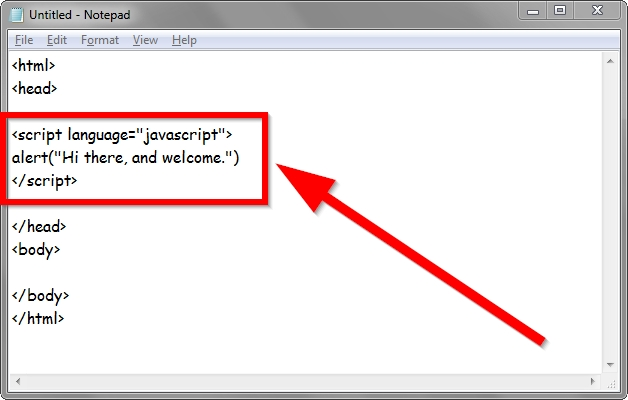

npm-add-script
----------------

programmatically add `scripts` entries to yr package.json file.

[](https://nodei.co/npm/npm-add-script/)
[](https://github.com/feross/standard)
[](http://travis-ci.org/YR_TRAVIS_USER_NAME/npm-add-script)

OK SO you can use `--save` or `--save-dev` to download modules and save them to yr package.json. But what if you are building a tool that generates stuff for projects and you need to be able to insert a brand new script into an existing thing? Or what if you want to just add a script entry at the command line because you've already been running and re-running the same convoluted test command for hours?!?!

NPM-ADD-SCRIPT IS HERE.



### CLI

To use as a cli tool, just install it globally!  This is most probably what you want if you just want command line manipulation of scripts entries.

`npm install -g npm-add-script`

```
--~~===////|||||NPM-ADD-SCRIPT|||||\\\\\===~~--
           - add scripts to yr package.json's!

Options:
  -k, --key    the name of your script                                [required]
  -v, --value  your script                                            [required]
  -h, --help   Show help                                               [boolean]

Examples:
  npmAddScript -k test -v "node test.js"
```


### API

If you're making some sort of project scaffolding tool or test library or i don't know what you can also call this from node. For example, maybe your library requires a convoluted series of manuevers to work properly, you could automagically add those commands as a scripts entry!

```javascript
  var npmAddScript = require('npm-add-script')
  // do some stuff related to yr special snowflake of a node module
  npmAddScript({key: "specialSnowFlake" , value: "node special_snowflake.js"})
```